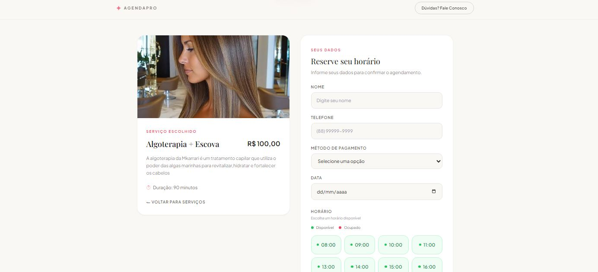
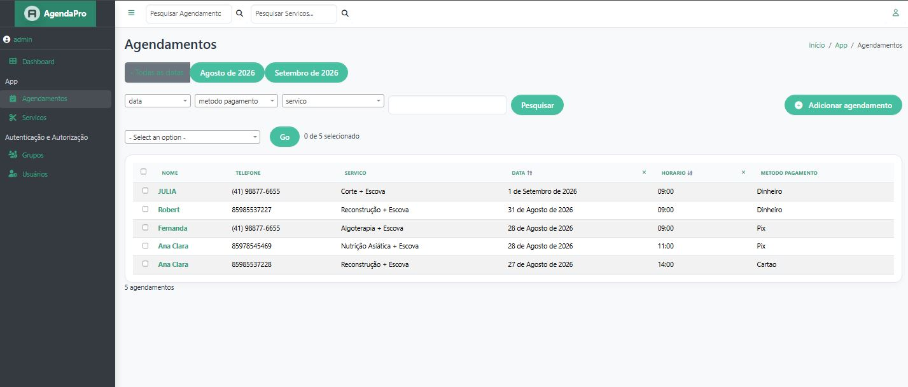

#  Sistema de Agendamento

Sistema web de agendamento desenvolvido com **Python e Django**, com gerenciamento de serviços, clientes, horários e agendamentos.

O projeto foi desenvolvido do zero e publicado em **produção**, utilizando PostgreSQL, Supabase Storage e Render.

🔗 **Demo:** https://agenda-4hdy.onrender.com
🔗 **Repositório:** https://github.com/misael-tech/sistema-agenda

---

##  Demonstração

### Página de agendamento



### Área administrativa



### Serviços


---

##  Funcionalidades

* 📅 Agendamento de serviços
* ⏰ Controle de horários disponíveis
* 🚫 Bloqueio de horários já ocupados
* 💼 Cadastro e gerenciamento de serviços
* 💰 Definição de preços e duração dos serviços
* 👤 Cadastro de clientes
* 📱 Cadastro de telefone
* 💳 Seleção do método de pagamento
* 🖼️ Upload de imagens dos serviços
* 🔐 Sistema de usuários e autenticação
* ⚙️ Área administrativa personalizada
* 🔎 Pesquisa e filtros no Django Admin

---

##  Tecnologias

### Backend

* Python
* Django
* Django ORM
* PostgreSQL

### Frontend

* HTML5
* CSS3
* JavaScript
* Tailwind CSS

### Infraestrutura

* Render
* Supabase Storage
* Git
* GitHub
* Jazzmin

---

##  Estrutura

```text
sistema-agenda/
│
├── app/
│   ├── models.py
│   ├── views.py
│   ├── forms.py
│   ├── admin.py
│   ├── urls.py
│   └── storage.py
│
├── core/
│   ├── settings.py
│   ├── urls.py
│   └── wsgi.py
│
├── templates/
├── static/
├── manage.py
├── requirements.txt
└── README.md
```

---

##  Executar localmente

Clone o projeto:

```bash
git clone https://github.com/misael-tech/sistema-agenda.git
cd sistema-agenda
```

Crie o ambiente virtual:

```bash
python -m venv venv
```

Ative o ambiente virtual.

**Windows:**

```bash
venv\Scripts\activate
```

**Linux/macOS:**

```bash
source venv/bin/activate
```

Instale as dependências:

```bash
pip install -r requirements.txt
```

Execute as migrações:

```bash
python manage.py migrate
```

Crie um usuário administrador:

```bash
python manage.py createsuperuser
```

Inicie o servidor:

```bash
python manage.py runserver
```

Acesse:

```text
http://127.0.0.1:8000/
```

>  As credenciais e configurações sensíveis devem ser definidas através de variáveis de ambiente. O arquivo `.env` não faz parte do repositório.

---

## ☁️ Deploy

A aplicação está publicada em produção utilizando:

* **Render** para hospedagem
* **PostgreSQL** para banco de dados
* **Supabase Storage** para armazenamento de imagens

As informações sensíveis são configuradas através de variáveis de ambiente.

---

##  O que este projeto representa

Este projeto foi desenvolvido para colocar em prática conhecimentos de desenvolvimento web com **Python e Django**, incluindo:

* MVT
* Models e Django ORM
* Views
* Forms
* Templates
* CRUD
* Autenticação
* Django Admin
* PostgreSQL
* Upload e armazenamento de arquivos
* JavaScript
* Git/GitHub
* Deploy em produção
* Variáveis de ambiente

---

##  Próximas melhorias

* [ ] Testes automatizados
* [ ] Cancelamento de agendamentos
* [ ] Confirmação de agendamentos
* [ ] Notificações via WhatsApp
* [ ] Dashboard com métricas
* [ ] Relatórios
* [ ] API REST

---

## 👨‍💻 Sobre mim

**Misael Alves**

Estudante de **Análise e Desenvolvimento de Sistemas**, com foco em desenvolvimento **Backend com Python e Django**.

Atualmente estudo e desenvolvo projetos utilizando Python, Django, PostgreSQL, Git/GitHub e tecnologias relacionadas ao desenvolvimento web.

###  Objetivo profissional

Atuar como **Desenvolvedor Python/Django Júnior**, contribuindo para projetos reais e evoluindo continuamente minhas habilidades em desenvolvimento backend.

### 🔗 Links

* GitHub: https://github.com/misael-tech
* LinkedIn: https://www.linkedin.com/in/misael-alves-b510323a7

---

 **Este projeto faz parte do meu portfólio e demonstra minha experiência prática no desenvolvimento e deploy de uma aplicação web com Django.**
